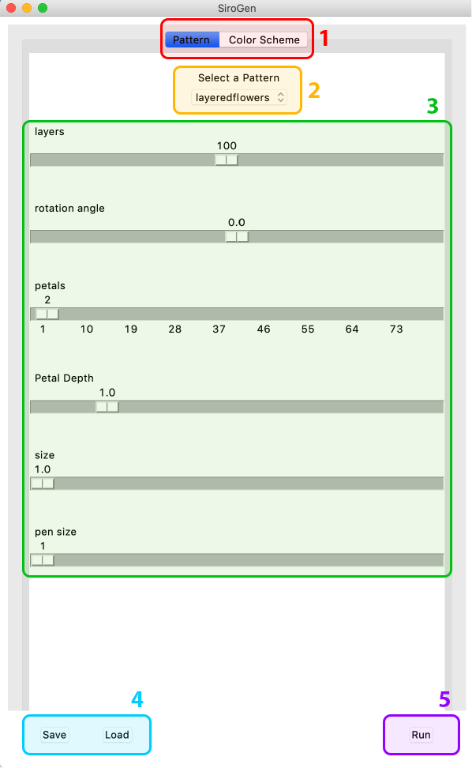
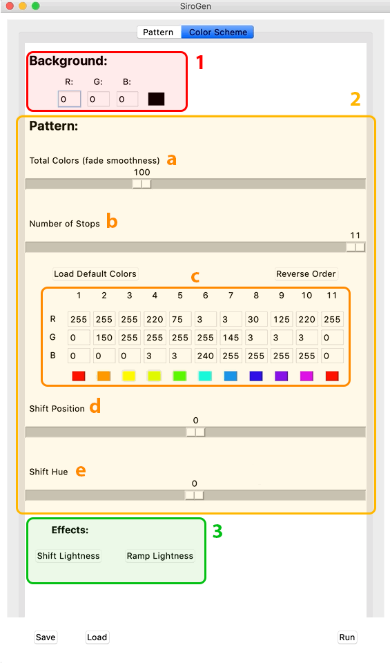
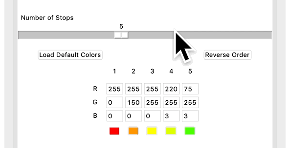
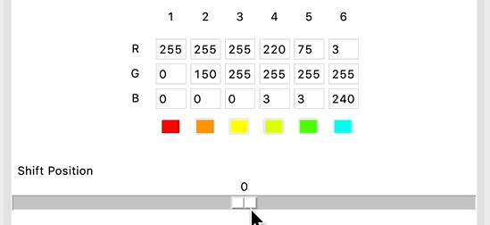
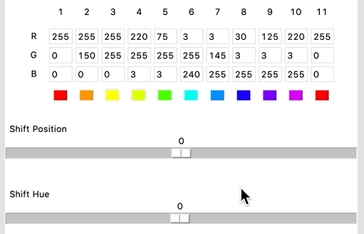

# SpiroGen
## A Playground for Making Geometric Patterns

<br><br/>
## To get started:
#### 1. Download or clone this project
#### 2. Open a terminal session in the project folder (optionally create a virtual environment) and run the following command: 
```shell
pip install -r requirements.txt
```
#### 3. Run SpiroGen.py
### 4. Have fun!!

#### I recommend starting off by loading a few of the examples that come preinstalled and playing with them a bit before trying to build from scratch
#### The tutorial will open on first launch, but if you need to find it again, you can find it in the help section of the menu.


[comment]: <> (##Basic Functionality:)


<br/>

## The Pattern Tab:



<h3 style="color: #FF0000">1. Main Navigation</h3>
The application is split into 2 main tabs: the 'Pattern' tab, and the 'Color 
Scheme' tab. The pattern tab is where you configure the parameters for the 
shape, form, and geometry of the pattern, and the color scheme tab is for 
configuring the set of colors used in the drawing

<h3 style="color: #FFBB0F">2. Pattern Type Selector</h3>
Use this to switch between the different pattern types. There are 5 pattern 
types to choose from, and each pattern type has a unique set of parameters. 

<h3 style="color: #04C014">3. Pattern Controls Section</h3>
This section is for configuration of the shape and form of the patterns. Each 
pattern type has a unique set of controls. The effects of some parameters are 
not always clear from their label, and can be different given different 
combinations, but the best way to familiarize yourself is to tweak them 
individually and see how the image changes. 

<h3 style="color: #00CCFF">4. Open Load/Save Dialogue</h3>
These two buttons open the saving and loading menus respectively. You can save 
and load the entire configuration, or you can save and load the pattern and 
color schemes individually. This allows you to try a given pattern with a few 
different color schemes and vice versa. 

Note: It's currently only possible to save pattern parameters, not the images 
they produce. To save the image, you'll have to take a screenshot.

<h3 style="color: #A323FF">5. Run Button</h3>
Press this button to see the pattern! This will open a new window where the 
pattern will be drawn.

<br/><br/>

## The Color Scheme Tab:
### Color scheme basics:
The color scheme parameters define a set of colors that will be cycled through 
while drawing. The different pattern types cycle through the colors a bit 
differently, but in general, every 'next' turn, shape, or line drawn will be a 
different color. One important thing to note is that fades are generated 
between inner stops, but not when wrapping back around to the beginning.



<h3 style="color: #FF0000">1. Background Color</h3>
This is just a single RGB color representing the background color of the 
drawing. Values can be entered manually, or you can click on the swatch to 
open the gui color editor.

<h3 style="color: #D69D00">2. Main Color Controls</h3>
These are the primary controls for the color of the pattern being drawn.

[comment]: <> (<div style="padding-left: 8%">)
<h4 style="color: #FF8A00; display: inline; margin-right: 10px;"> 
    2a. Total Colors: 
</h4>
This controls the total number of colors generated that will be cycled 
through before repeating. When set higher than the number of stops, 
intermediary colors will be generated with the defined stops spaced evenly.
If you want the pattern to repeat completely a given number of times, make 
sure that it is a multiple of the number of lines, turns, shapes, etc. 
defined for the pattern itself.


<br/>
<br/>

<h4 style="color: #FF8A00; display: inline; margin-right: 10px; margin-top: 10px;"> 
    2b. Number of Stops: 
</h4>
This controls the number of colors you will be fading between in the 
pattern, and changes the number of swatches visible in the section 
below accordingly. The maximum possible is 11 stops. 

<b>Important note: </b> you always have 11 stops set, this parameter only 
controls which ones are used in the pattern. This affects the way that the 
'Shift Position' control works. More info on that below. 


    

<h4 style="color: #FF8A00; display: inline; margin-right: 10px; margin-top: 10px;"> 
    2c. Stop Color Controls: 
</h4>
This is where you set the color values themselves. Each column is a different 
stop along the gradiant, and each row a different color channel (rgb). You can 
set the values manually if you want to, but you can access the gui color editor 
by clicking on the swatch for any given stop. The 'Load Default Colors' button 
will set the colors to the default rainbow. The 'Reverse Order' button reverses 
the order of the colors you have set, but...

<b>Important note: </b> The 'Reverse Order' control reverses the order of your 
entire 11 swatch set, and auto-repositioning is not implemented, so if you have 
fewer than 11 color stops set, you are likely to be confused by the results of 
this button. The key is to reverse, then use the 'Shift Position' control to 
shift back into the range of colors you originally had selected.

More info on the gui color editor below.


<h4 style="color: #FF8A00; display: inline; margin-right: 10px; margin-top: 10px;"> 
    2d. Shift Position: 
</h4>
This control allows you to shift the positions of your swatches. This allows 
you to quickly change the 'phase' of the colors in the pattern. 

<b>Important note: </b> You always have 11 color swatches in your color 
palette, whether they are included in the pattern or not. This allows you to 
experiment with faux hue-shift type effects, but it can also cause confusion. 
If you are frustrated to achieve a shift that you are looking for, check out 
the info below on the details of the color swatch editor.




<h4 style="color: #FF8A00; display: inline; margin-right: 10px; margin-top: 10px;"> 
    2e. Shift Hue: 
</h4>
This control shifts the hue of your color set. This control does modify the 
color values directly, so your swatches in the color editor will change as 
well.

<b>Note: </b> If you reload the default colors when the hue is shifted, the 
original colors will be loaded, but the position of this parameter will not 
change, so although the hue is no longer zero-centered, you can still reach all 
possible hue-shift positions




<br/><br/>


<h3 style="color: #55D45E">3. Color Effects</h3>
This section contains a few effects that can be applied to the currently 
selected set of color swatches.

#### Warning: Color effects are not reversible. Save your color scheme before applying if you are at all attached to it!


<h4 style="color: #55D45E; display: inline; margin-right: 10px; margin-top: 10px;"> 
        Shift Lightness: 
    </h4>
    This effect shifts the values of your entire color set (not just the ones 
    currently used and visible) to be lighter or darker. There is only one 
    parameter, and it can be set between -255 (black) and 255 (white). All 
    colors will be equally effected.
<br/>
<br/>
    <h4 style="color: #55D45E; display: inline; margin-right: 10px; margin-top: 10px;"> 
        Ramp Lightness: 
    </h4>
    This effect allows you to ramp the lightness of your color set. 

The 'Amount' parameter is a value between -255 (black) and 255 (white) that you 
want to shift in the direction of.

The 'Direction' option ('left' or 'right') defines the side of the currently 
defined set of colors that you want to be *maximally* effected.

The 'Go To %' parameter is the percentage of the currently selected (<b> NOT 
the entire 11 color set!</b>) that you want the fade to fade up to. for 
example, if you have 10 colors selected with no shift applied, and you apply a 
ramp effect of -255 with direction set to 'right', and 'Go To %' set to 50, the 
first 5 colors will be exactly as they were, and starting at color 6, they will 
be darker and darker versions of their original selves up to color 10, which 
will be completely black.

<b>Note: </b> This can produce confusing effects if the 'Go To %' uses only a 
few colors. For example, if it's set to 10%, but you only have 10 colors, it 
will make the first color black, and leave the rest exactly as it was

<b>Important note: </b> Again, this effect does apply only to the current 
selection of colors, not the entire 11-color set


<br/>

### More Info Coming Soon!
